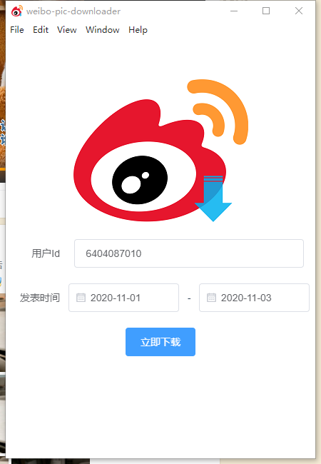
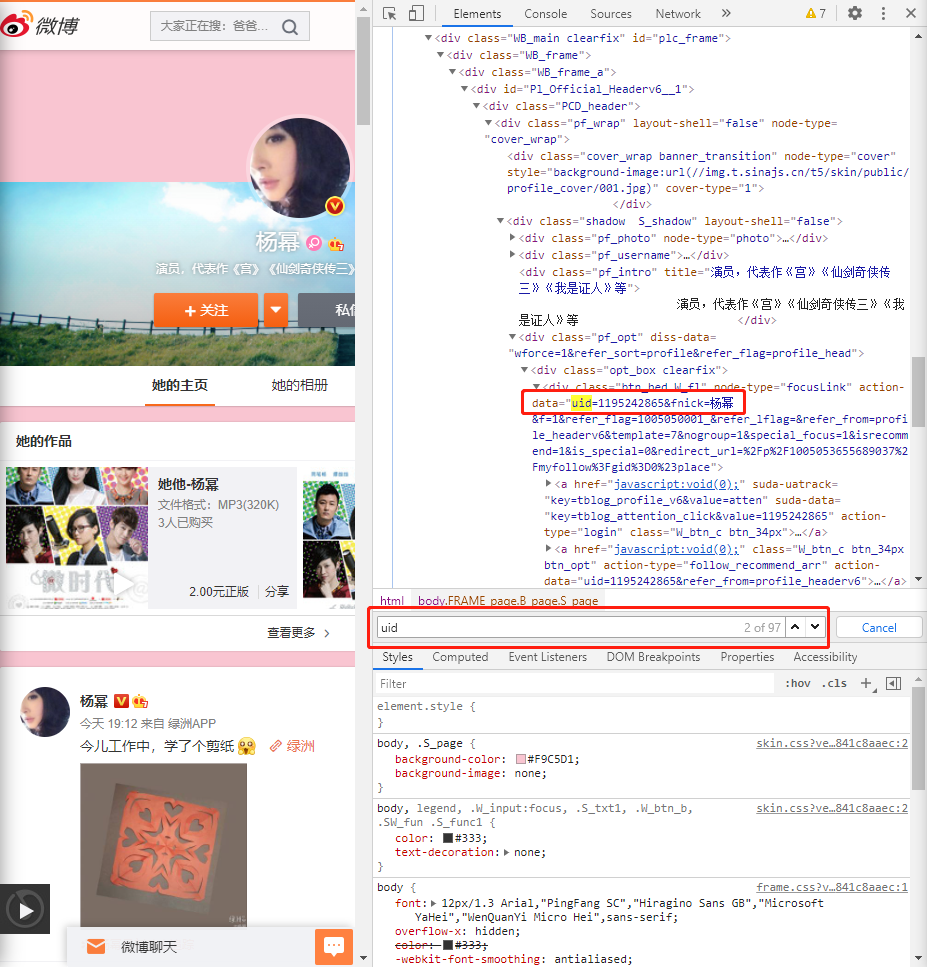
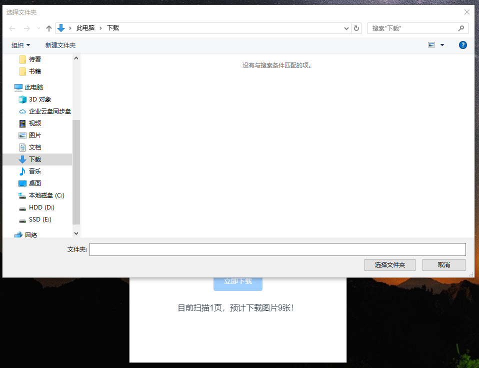
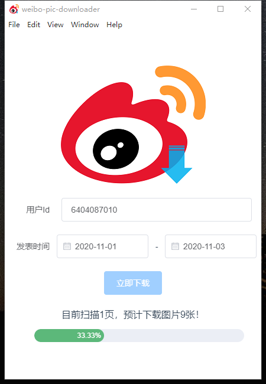
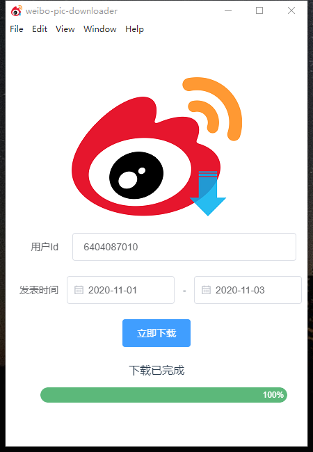

## weibo-pic-downloader

<p align="center">
<image src="./public/Logo.png" width="320px" height="310px"></image>
    <div style="text-align:center; margin:0 auto">
        一个使用Electron-Vue + ElementUI构建的免登录下载微博图片的桌面爬虫应用；
    </div>
</p>

### 安装方法

**① 压缩包方式安装**

下载右侧对应平台的Release包，解压缩即可；

**② 源码编译**

克隆本项目：

```bash
git clone git@github.com:JasonkayZK/weiboPicDownloader.git
```

使用yarn或npm安装依赖：

```bash
npm install
或
yarn install
```

编译本项目：

```bash
# win平台：
npm run electron:build -- --win nsis
# mac平台：
npm run electron:build -- --mac
# linux平台：
npm run electron:build -- --linux deb
```

>   交叉编译时可能会遇到问题，解决方案见：
>   
>   [在Win10下交叉编译Electron项目](https://jasonkayzk.github.io/2020/11/08/在Win10下交叉编译Electron项目/)

更多编译选项，见：

>   Vue CLI Plugin Electron Builder官方文档：
>
>   [Vue CLI Plugin Electron Builder](https://nklayman.github.io/vue-cli-plugin-electron-builder/)

**③ 本地调试**

使用yarn或npm安装依赖完成后，使用下面的命令进入本地开发调试：

```bash
npm run electron:serve
```

### 使用方法

**① 运行并填写信息**

双击运行`WeiboPicDownloader.exe`，界面如下图：



填入微博用户UID，不知道UID的可以Google搜索，或是参考下面的方法：

>   **① url路径获取**
>
>   如果用户没有设置个性域名，则url中就包括了其userID，如：
>
>   https://weibo.com/u/6404087010?is_all=1
>
>   其中6404087010就是用户的userId；
>
>   如下图所示：
>
>   
>
>   **② 网页源代码获取**
>
>   有些时候用户设置了个性域名，例如：
>
>   https://weibo.com/yangmiblog?is_all=1
>
>   此时需要在网页源代码中查找userId：
>
>   在当前用户页面按下F12(或其他可以打开浏览器控制台的快捷键)打开控制台；
>
>   按下Ctrl + F进入搜索，输入uid，即可查找到用户的userId，如下图：
>
>   

输入用户ID，并选择下载日期区间后点击立即下载；

****

**② 等待爬虫**

点击立即下载后，程序会进行爬虫，并报告爬虫进度；

****

**③ 选择保存路径**

爬虫完成后，会弹出保存窗口，选择图片保存的路径即可开始下载；



下载过程中会有进度条显示，如下图：



****

**④ 下载完成**

最终下载完成即可在保存目录找到你下载的图片啦！



### 更多说明

本项目采用MIT许可，大家可以在本代码的基础之上自由的做二次开发！

觉得好用的可以点个star~

觉得不好的也可以提出你的issue~

相关博文：

-   [手把手教你使用Electron开发新浪微博免登录图片下载器](https://jasonkayzk.github.io/2020/11/04/%E6%89%8B%E6%8A%8A%E6%89%8B%E6%95%99%E4%BD%A0%E4%BD%BF%E7%94%A8Electron%E5%BC%80%E5%8F%91%E6%96%B0%E6%B5%AA%E5%BE%AE%E5%8D%9A%E5%85%8D%E7%99%BB%E5%BD%95%E5%9B%BE%E7%89%87%E4%B8%8B%E8%BD%BD%E5%99%A8/)

